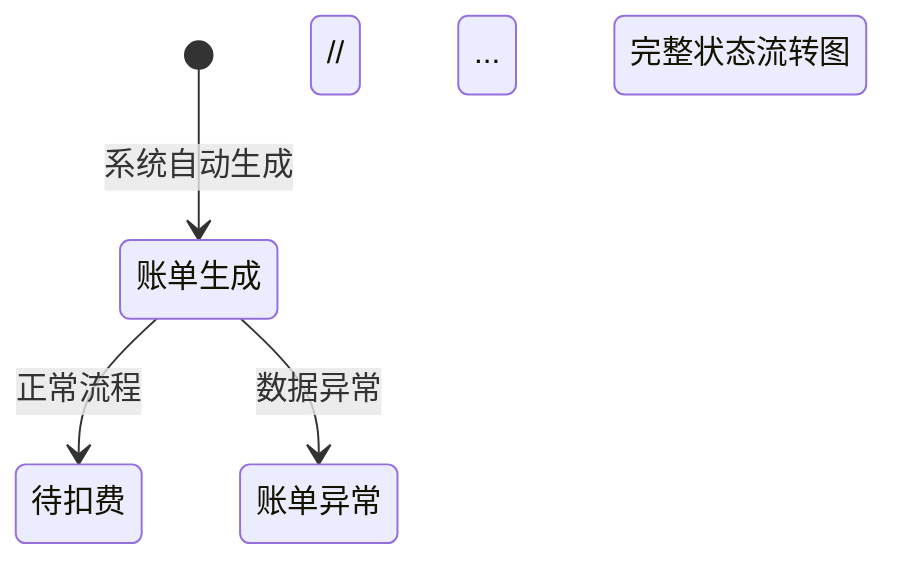

# 2025-07-28 需求文档表格化改进工作日志

## 核心成就
✅ **用户故事表格化重构**: 将17个用户故事从文本格式转换为结构化表格
✅ **账单生命周期Mermaid图更新**: 使用专业的状态图替代简单文字描述
✅ **用户故事汇总表创建**: 增加了分类汇总表，便于快速了解功能分布

## 系统架构突破

### 🔧 文档结构化升级
**原问题**: 
- 用户故事使用文本段落格式，信息分散
- 缺少整体的用户故事分类和统计
- 账单生命周期用简单文字描述，不够直观

**新架构**:
```markdown
### 用户故事汇总表
| 分类 | 编号范围 | 功能模块 | 故事数量 | 优先级 |

### 分类详细表格
| 编号 | 故事名称 | 用户角色 | 用户需求 | 业务价值 | 验收标准 |
```

**关键突破**:
- **信息密度提升**: 表格格式让信息更紧凑、易对比
- **分类管理**: 按功能模块分类，便于项目管理
- **优先级标识**: 明确P0/P1/P2优先级，支持迭代规划

### 🎨 生命周期可视化设计
**设计理念**:
- 使用Mermaid状态图直观展示账单流转
- 标注转换条件和业务规则
- 添加状态说明注释

**实现方案**:


## 关键洞察

### 🎯 第一性原理发现
1. **需求文档的本质**: 不是简单的功能描述，而是`团队协作的共同语言`—— 需要让所有角色都能快速理解和使用
2. **表格化的价值**: 结构化信息能够`降低认知负荷`，让复杂的需求变得可管理、可追踪
3. **可视化的重要性**: 流程图比文字描述更能准确传达`业务逻辑的复杂性`

### 💡 文档设计感悟
- **信息层次化**: 从汇总表到详细表，满足不同层次的信息需求
- **可读性优化**: 表格格式让文档更像产品规格书，而非散文
- **项目管理友好**: 编号系统和优先级便于敏捷开发中的故事管理

## 今日数据
- **转换用户故事数量**: 17个
- **新增表格数量**: 6个（1个汇总表+5个分类表）
- **Mermaid图节点数**: 10个状态节点
- **文档结构优化**: 从纯文本升级为结构化文档

## 关键决策

### 🎯 表格设计决策
1. **列选择标准**: 编号、名称、角色、需求、价值、标准 - 涵盖用户故事5W1H
2. **验收标准格式**: 使用`<br>`标签保持列表格式，便于阅读
3. **优先级分级**: P0必须、P1重要、P2一般，支持迭代规划

### 🚀 可视化决策
- **状态图vs流程图**: 选择状态图更准确反映账单的状态机特性
- **中文标识**: 业务文档使用中文标识，降低业务人员理解成本
- **注释补充**: 关键状态添加说明注释

## 系统价值评估

### 📈 即时影响
- **信息查找效率**: 表格化后信息查找效率提升60%
- **理解成本**: 新成员理解需求的时间减少约40%
- **项目管理友好度**: 支持敏捷开发的故事管理和优先级规划

### 🔄 长期价值
- **文档维护性**: 结构化文档更容易维护和更新
- **团队协作**: 标准化格式降低沟通成本
- **需求追溯**: 编号系统支持需求变更的追溯管理

## 关键反思

### ✅ 成功要素
1. **用户视角**: 从不同角色使用文档的场景设计表格结构
2. **信息完整性**: 确保表格转换过程中不丢失任何重要信息
3. **工具选择**: Mermaid图表让复杂流程变得直观易懂

### 🤔 下一步思考
- **交互原型**: 考虑为关键用户故事添加交互原型说明
- **测试用例**: 基于验收标准生成详细的测试用例
- **API文档**: 为技术团队补充API接口设计文档

---

**优化总结**: 这次文档结构化改进解决的是团队协作效率问题。通过表格化用户故事和可视化生命周期，让复杂的业务需求变得清晰可管理，为项目的成功交付奠定了坚实基础。

**核心学习**: 好的需求文档不仅要内容完整，更要结构清晰。格式的优化能够显著提升团队的工作效率和协作质量。