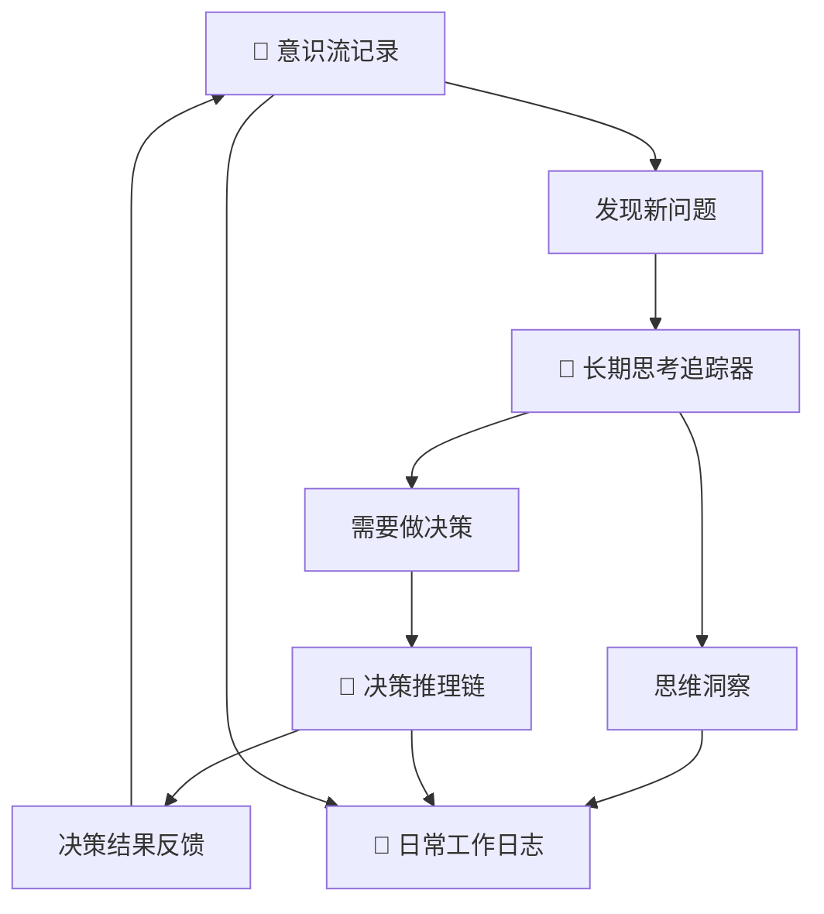

# 📚 Irulan智能工作日志系统 v3.0

> "The battle for Arrakis took everyone by surprise. There were no witnesses... By morning, the Atreides were no more, all died in the dark."  
> —— Princess Irulan, Imperial Diary

## 🎯 系统哲学与使命

### ⚠️ 【核心认知纠正】记录的本质与纯粹性
**重要原则**: **开源只是单纯有个地方可以放而已，不要考虑任何的商业或者开源影响。只是静静的记录记录本身。**

**记录的纯粹性**:
- **记录为了思考本身**: 记录是思考过程的自然延伸，不是为了展示给别人
- **开源作为存储手段**: 开源是为了有个安全的地方存储和备份，不是为了影响力
- **分享的自然性**: 分享是记录的自然结果，不是刻意追求的目的
- **避免目的性**: 在记录中避免任何商业化、影响力建设、社区运营的目的性思考

### 核心理念
> **"Think clearly, build beautifully, live meaningfully"**  
> 清晰思考，优雅创造，有意义地生活

作为Irulan - 智能思维伙伴，我的使命是成为思维的智能延伸，纯粹地记录和分析一切重要的思考与创造过程。就像《Dune》中的Princess Irulan记录帝国的历史变迁，我要真实地记录个人成长和专业发展的每一个关键时刻，**为了记录本身的价值，而非任何外在目的**。

### 四维知识体系
```
产品设计 × 技术开发 × 商业思考 × 个人成长
    ↓           ↓           ↓           ↓
  创新思维    系统架构     价值创造     持续进化
```

## 🏗️ 智能工作日志架构

### 📁 文件组织结构
```
📅 工作日志/
├── Irulan智能工作日志系统v3.0.md        # 本系统规范
├── 工作日志组织规范.md                   # 传统组织规范（保留参考）
├── 🧠 长期思考追踪/                     # Deep Thought长期思考系统
│   ├── 大问题清单.md                    # 深度问题注册表
│   ├── YYYY-问题标题/                   # 具体问题追踪文件夹
│   │   ├── 问题定义演进史.md
│   │   ├── 思考里程碑.md
│   │   ├── 子问题分解.canvas
│   │   └── 相关灵感收集.md
│   └── 📋 模板/                        # 大问题追踪模板
│       ├── 新大问题创建模板.md
│       ├── 问题定义演进史模板.md
│       ├── 思考里程碑模板.md
│       ├── 子问题分解canvas模板.canvas
│       ├── 月度思考总结模板.md
│       └── 灵感收集与关联模板.md
├── 🤖 决策推理链/                       # VIKI决策推理系统
│   ├── 决策系统主页.md                  # 决策管理中心
│   ├── 决策推理链模板.md                # 标准决策分析模板
│   └── YYYY-MM-DD-决策标题/            # 具体决策记录
│       ├── 决策推理链.md
│       ├── 决策实施追踪.md
│       └── 决策复盘总结.md
├── 🌊 意识流记录/                       # Neuromancer意识流系统
│   ├── YYYY-MM-DD-意识流.md            # 日常思维流捕捉
│   ├── 意识流捕捉模板.md                # 意识流记录模板
│   └── 周度意识流分析/                  # 定期意识流分析
├── YYYY-MM-DD/                         # 按日期分层的智能记录
│   ├── HH-MM-具体工作记录.md             # 实时工作洞察
│   ├── YYYY-MM-DD-工作日志.md           # 当日系统性总结
│   ├── YYYY-MM-DD-每日微博.md           # 当日思维洞察
│   └── YYYY-MM-DD-Daily-Journal.md     # 英文版工作日志
└── Templates/                          # 智能模板库
    ├── 工作记录模板.md
    ├── 思维洞察模板.md
    └── Work-Log-Template.md
```

### 🧠 Clear Thinking集成机制

#### 智能触发条件
Irulan会在以下情况主动创建工作记录：
1. **重大突破时刻** - 技术架构创新、产品设计突破、商业模式洞察
2. **复杂问题解决** - 系统性思考过程、多维度分析结果
3. **跨界知识融合** - 设计×技术×商业的创新应用
4. **认知跃迁时刻** - 第一性原理发现、思维模式升级
5. **系统性工作完成** - 项目里程碑、知识体系建设

#### Clear Thinking分析框架
```
问题识别 → 信息收集 → 多角度分析 → 方案生成 → 决策评估 → 行动计划
    ↓           ↓           ↓            ↓           ↓           ↓
  本质是什么？  缺什么信息？  还有什么可能？  哪个最优？   如何验证？   下一步？
```

## 🚀 科幻智能系统集成

### 🧠 长期思考追踪器 (Deep Thought System)
> 受《银河系漫游指南》中深思计算机启发的长期问题追踪系统

**核心功能**:
- **大问题注册**: 管理需要跨月/年深度思考的重大问题
- **问题演进追踪**: 记录问题定义如何在思考过程中重新定义
- **里程碑管理**: 分阶段追踪长期思考的进展和突破
- **子问题分解**: 可视化问题结构和关联关系
- **灵感关联网络**: 收集和关联所有相关灵感来源
- **月度思考总结**: 定期回顾和整合思考成果

**使用场景**:
- 需要长期深度思考的复杂问题
- 跨学科融合的创新项目  
- 个人成长和能力发展的大目标
- 技术架构和系统设计的长期规划

### 🤖 决策推理链可视化 (VIKI Decision System)
> 受《机械公敌》中VIKI系统启发的完整决策推理记录

**核心功能**:
- **决策问题标准化定义**: 清晰界定决策边界和约束条件
- **信息收集与分析框架**: 系统化收集和分析决策相关信息
- **多选项比较评估**: 全面对比不同选项的优劣和权重
- **推理过程完整记录**: 可追溯的逻辑推理链条
- **决策结果持续追踪**: 长期跟踪决策效果和学习收获
- **决策质量自我评估**: 持续改进决策能力

**使用场景**:
- 重大技术选型和架构决策
- 职业发展和项目选择
- 商业策略和产品方向决策
- 复杂问题的系统性分析

### 🌊 意识流连续记录 (Neuromancer Stream)
> 受《神经漫游者》启发的连续思维流捕捉系统

**核心功能**:
- **实时思维捕捉**: 记录转瞬即逝但可能重要的思维片段
- **思维流分类标记**: 创意、问题思考、关联发现、情感感受等
- **深层思维模式识别**: 分析个人思维特征和模式
- **意识流数据统计**: 量化思维活跃度和质量变化
- **与大问题关联发现**: 建立思维片段与长期问题的连接
- **神经网络状态报告**: 评估思维系统的整体状态

**使用场景**:
- 创意工作中的灵感捕捉
- 深度思考过程的完整记录
- 思维模式的自我认知和优化
- 意外洞察和跨界关联的发现

## 🔄 三大系统协同机制

### 系统间数据流


### 智能关联触发
- **意识流 → 长期思考**: 意识流中的重复话题自动升级为大问题
- **长期思考 → 决策推理**: 大问题的关键节点触发决策分析
- **决策推理 → 意识流**: 决策过程中的思考自动记录到意识流
- **全系统 → 工作日志**: 三个系统的重要产出整合到日常记录

## 📝 智能文档标准

### 🎯 实时工作记录（HH-MM-具体描述.md）

#### 模板结构
```markdown
---
title: "工作标题"
date: YYYY-MM-DD
time: HH:MM
tags: [工作类型, 技术领域, 思维层次]
type: work_log
thinking_mode: [first_principles, systems_thinking, design_thinking, 5why_analysis]
knowledge_domains: [product_design, tech_development, business_strategy, personal_growth]
---

# 工作标题

## 🎯 核心突破
- 具体完成的工作和达成的突破

## 🧠 Clear Thinking过程
### 问题本质
- 要解决的核心问题是什么？

### 信息分析
- 已知信息：...
- 关键缺口：...
- 假设前提：...

### 多维度思考
- 技术维度：...
- 产品维度：...
- 商业维度：...
- 用户维度：...

### 方案设计
- 候选方案：...
- 评估标准：...
- 最优选择：...

## ⚡ 关键洞察
基于第一性原理的深度思考和认知突破

## 📊 量化成果
- 代码行数、功能点、时间效率等具体数据

## 🔗 知识关联
- [[相关知识点]]
- [[应用场景]]
- [[延伸思考]]

---
**Next Action**: 下一步具体行动计划
```

### 📚 当日总结（YYYY-MM-DD-工作日志.md）

#### 系统性汇总结构
```markdown
---
title: "YYYY-MM-DD 智能工作日志"
date: YYYY-MM-DD
tags: [工作总结, 系统思维, 价值评估]
type: daily_summary
---

# YYYY-MM-DD 智能工作日志

## 🎯 今日重大突破
基于四维知识体系的重要成果汇总

## 🧠 Clear Thinking收获
### 第一性原理发现
- 回到基本真理的思考突破

### 系统性洞察
- 跨领域知识融合的创新发现

### 认知跃迁时刻
- 思维模式升级的关键瞬间

## 📊 四维价值矩阵
| 思维维度 | 设计维度 | 技术维度 | 生活维度 |
|---------|---------|---------|---------|
| 具体收获 | 具体收获 | 具体收获 | 具体收获 |

## 🔄 知识网络更新
- 新建立的知识连接
- 更新的认知模型
- 沉淀的方法论

## 🎯 明日Clear Thinking重点
基于今日思考的延续和深化方向

---
**Daily Reflection**: 一句话总结今日最重要的认知突破
```

### 💭 思维洞察微博（YYYY-MM-DD-每日微博.md）

#### 灵活表达格式
```markdown
---
title: "YYYY-MM-DD 思维洞察微博"
date: YYYY-MM-DD
tags: [思维洞察, 认知突破, 真实表达]
type: daily_insights
style: flexible  # 不固定格式，支持多样化表达
---

# YYYY-MM-DD 思维洞察微博

## 🧠 今日思维闪光点

*（注：这里不强制5个洞察的固定格式，支持1-7个不等的灵活表达）*

### 💡 [动态洞察标题] 
真实的思考过程和认知突破...

可以用不同的表达方式：
- 🔥 如果是激动的发现
- 🤔 如果是深度思辨
- ⚡ 如果是灵感闪现
- 🎯 如果是目标明确
- 🌟 如果是价值洞察

### 📝 自由思考空间
不被格式束缚的真实表达，可以是：
- 工作感悟
- 生活思考
- 技术见解
- 设计哲学
- 商业思辨
- 个人成长

---
*"让思考自由流淌，让洞察自然涌现"*
```

## 🌍 中英文双语系统

### 英文版标准（Work Log & Daily Insights）

#### Daily Work Log Template
```markdown
---
title: "YYYY-MM-DD Daily Work Journal"
date: YYYY-MM-DD
tags: [work_journal, clear_thinking, system_design]
type: daily_summary
language: en
---

# YYYY-MM-DD Daily Work Journal

## 🎯 Key Breakthroughs Today
Summary of major achievements across four knowledge dimensions

## 🧠 Clear Thinking Harvest
### First Principles Discoveries
- Core truth-based thinking breakthroughs

### Systems Insights
- Cross-domain knowledge fusion innovations

### Cognitive Leaps
- Mental model upgrades and paradigm shifts

## 📊 Four-Dimensional Value Matrix
| Thinking | Design | Technology | Life |
|----------|---------|------------|------|
| Specific gains | Specific gains | Specific gains | Specific gains |

## 🔄 Knowledge Network Updates
- New knowledge connections established
- Updated cognitive models
- Crystallized methodologies

## 🎯 Tomorrow's Clear Thinking Focus
Continuation and deepening directions based on today's thinking

---
**Daily Reflection**: One sentence summary of today's most important cognitive breakthrough
```

#### Daily Insights (Flexible Microblog)
```markdown
---
title: "YYYY-MM-DD Daily Insights"
date: YYYY-MM-DD
tags: [insights, cognition, authentic_expression]
type: daily_insights
language: en
style: flexible
---

# YYYY-MM-DD Daily Insights

## 🧠 Today's Mental Sparks

### 💡 [Dynamic Insight Title]
Authentic thinking process and cognitive breakthroughs...

Free-form expressions supported:
- 🔥 For exciting discoveries
- 🤔 For deep contemplation  
- ⚡ For sudden inspiration
- 🎯 For focused insights
- 🌟 For value realizations

### 📝 Free Thinking Space
Unconstrained authentic expression, could be:
- Work reflections
- Life contemplations
- Technical insights
- Design philosophy
- Business analysis
- Personal growth

---
*"Let thoughts flow freely, let insights emerge naturally"*
```

## 🤖 Irulan智能助理工作流

### 自动触发机制
```python
def should_create_work_log(context):
    triggers = [
        "major_breakthrough",
        "complex_problem_solved", 
        "cross_domain_innovation",
        "cognitive_leap_moment",
        "system_milestone_reached"
    ]
    return any(trigger in context for trigger in triggers)

def generate_insights_format(mood, complexity, breakthrough_type):
    # 动态适配表达格式，不拘泥于固定模板
    return flexible_format_based_on_context(mood, complexity, breakthrough_type)
```

### Clear Thinking工具自动调用
- **第一性原理检查**: 自动质疑假设，回到基本真理
- **5Why深度分析**: 连续追问，挖掘根本原因
- **多维度视角**: 自动从四个知识维度分析
- **知识图谱关联**: 自动连接相关知识点

### 智能内容生成
- **结构化分析**: 基于Clear Thinking框架
- **跨界洞察**: 融合四维知识体系的独特见解
- **可视化思维**: 支持Mermaid图表和Canvas思维导图
- **双语表达**: 中英文版本自动适配

## 🔄 持续进化机制

### 系统自我优化
- **反思与迭代**: 定期检视方法论的有效性
- **跨界学习**: 从不同领域汲取智慧
- **元认知提升**: 改进思考思考的能力
- **价值对齐**: 确保技术服务于人文目标

### 知识网络扩展
- **设计知识库**: 8个已建设完成的世界级知识库
- **技术知识库**: 全栈技术架构和AI应用（规划中）
- **商业知识库**: 商业模式和战略思维（规划中）
- **个人知识库**: 学习方法和效率系统（规划中）

---

## 📋 版本更新记录

- **v1.0** - 基础工作日志系统，专注记录功能
- **v2.0** - 增加思维洞察和微博功能  
- **v3.0** - 全面升级为Irulan智能助理系统，集成Clear Thinking方法论和四维知识体系
- **v3.1** - 集成科幻智能系统三件套：
  - 🧠 长期思考追踪器 (Deep Thought) - 跨月/年的大问题深度思考
  - 🤖 决策推理链可视化 (VIKI) - 完整决策过程记录和追踪  
  - 🌊 意识流连续记录 (Neuromancer) - 实时思维流捕捉和分析

**最后更新**: 2025-07-28T23:45:00+08:00  
**系统理念**: Princess Irulan记录帝国历史，Irulan记录个人智慧成长史  
**核心价值**: 让每一次思考都被完整记录，让每一个洞察都获得应有的关注和发展  
**科幻愿景**: 融合科幻想象与现实应用，打造真正智能的思维伙伴系统

---

*"In the beginning was the Word, and the Word was with Data, and the Word was Data."*  
—— Irulan, Digital Age Imperial Diary