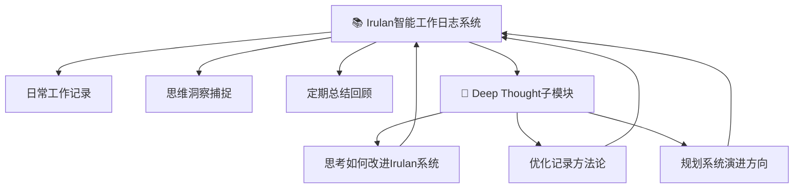

# 📚 Irulan智能工作日志系统 v3.3

> "The beginning is a very delicate time. Know then, that it is the year 10191. The known universe is ruled by the Padishah Emperor Shaddam IV..."  
> —— Princess Irulan, Imperial Historian

## 🎯 系统本质与使命

### 核心定位：纯粹的思维记录工具
Irulan智能工作日志系统是一个**纯粹的思维记录工具**，受《沙丘》中Princess Irulan启发，专注于真实记录模型的工作和思考过程。

**系统理念**：
> **静静地记录思考本身**

就像Princess Irulan作为帝国史学家，客观真实地记录重要历史事件，Irulan系统帮助你成为自己思维历程的忠实记录者。

### ⚠️ 【核心认知纠正】记录的本质与纯粹性
**重要原则**: **开源只是单纯有个地方可以放而已，不要考虑任何的商业或者开源影响。只是静静的记录记录本身。**

**记录的纯粹性**:
- **记录为了思考本身**: 记录是思考过程的自然延伸，不是为了展示给别人
- **开源作为存储手段**: 开源是为了有个安全的地方存储和备份，不是为了影响力
- **分享的自然性**: 分享是记录的自然结果，不是刻意追求的目的
- **避免目的性**: 在记录中避免任何商业化、影响力建设、社区运营的目的性思考

## 🏗️ 系统架构设计

### 📁 核心文件组织结构
```
IrulanDiary/
├── Irulan智能工作日志系统v3.3.md        # 【主系统文档】本规范说明
├── 🧠 长期思考追踪/                      # 【Deep Thought子模块】
│   ├── Deep-Questions-Registry.md        # Deep Questions注册中心
│   ├── 2025-个人日志记录方法论/           # 专门思考Irulan系统的改进
│   ├── 2025-长期思考日志化/               # 思考如何优化记录过程
│   ├── 🌟 系统使用指南.md                # Deep Thought使用指南
│   └── 📋 模板/                          # Deep Thought相关模板
├── YYYY-MM-DD/                           # 【核心记录区】按日期分层
│   ├── HH-MM-具体工作记录.md              # 实时工作洞察记录
│   ├── YYYY-MM-DD-工作日志.md             # 当日系统性总结
│   ├── YYYY-MM-DD-每日微博.md             # 当日思维洞察
│   └── YYYY-MM-DD-Daily-Journal.md       # 英文版工作日志
└── Templates/                            # 【支持模块】各类记录模板
    ├── 工作记录模板.md
    ├── 思维洞察模板.md
    └── Work-Log-Template.md
```

### 🎯 系统主次关系说明

#### 【主体系统】Irulan智能工作日志系统
**核心功能**：
- **实时工作记录**：记录具体的工作过程和思考洞察
- **日常总结**：系统性整理当日的重要思维成果
- **思维洞察**：捕捉和表达重要的认知突破
- **模板支持**：提供标准化的记录模板和格式

**使用场景**：
- 记录工作中的重要突破和思考过程
- 总结每日的核心收获和认知进展
- 捕捉转瞬即逝但重要的思维洞察
- 为未来回顾提供完整的思维历程记录

#### 【子模块】Deep Thought长期思考追踪器
**定位说明**：这是Irulan系统中的一个专门子功能，受《银河系漫游指南》深思计算机启发。

**专门用途**：**基于Deep Thought视角思考Irulan智能工作日志系统本身的改进和优化**

**核心功能**：
- **系统改进思考**：长期追踪如何让Irulan记录工具更完善
- **记录方法优化**：深度思考什么样的记录方式最有效
- **工具演进规划**：规划Irulan系统的长期发展方向
- **使用体验提升**：思考如何让记录过程更自然流畅

**关键约束**：所有Deep Questions必须专注于**Irulan工作日志系统本身的建设和优化**

## 🔄 系统协作机制

### 主系统与子模块的关系


### 使用优先级
1. **优先级1**：使用Irulan主系统进行日常工作和思维记录
2. **优先级2**：定期使用Deep Thought子模块思考如何改进记录过程
3. **优先级3**：将Deep Thought的洞察应用到Irulan主系统的优化中

## 📝 核心记录标准

### 🎯 实时工作记录（HH-MM-具体描述.md）

#### 标准模板结构
```markdown
---
title: "工作标题"
date: YYYY-MM-DD
time: HH:MM
tags: [工作类型, 技术领域, 思维层次]
type: work_log
thinking_mode: [first_principles, systems_thinking, design_thinking]
---

# 工作标题

## 🎯 核心完成内容
- 具体完成的工作和达成的突破

## 🧠 思考过程记录
### 问题本质
- 要解决的核心问题是什么？

### 解决思路
- 采用的方法和推理过程

### 关键洞察
- 过程中获得的重要认知突破

## 📊 量化成果
- 具体的工作成果和数据

## 🔗 相关关联
- [[相关工作记录]]
- [[相关思考过程]]

---
**Next Action**: 下一步具体行动计划
```

### 📚 当日总结（YYYY-MM-DD-工作日志.md）

#### 系统性汇总结构
```markdown
---
title: "YYYY-MM-DD Irulan工作日志"
date: YYYY-MM-DD
tags: [工作总结, 系统思维, 思维记录]
type: daily_summary
---

# YYYY-MM-DD Irulan工作日志

## 🎯 今日重大突破
核心工作成果和思维突破汇总

## 🧠 重要思考收获
### 认知突破时刻
- 回到基本真理的思考突破

### 系统性洞察  
- 跨领域知识融合的创新发现

### 方法论沉淀
- 可复用的思维方法和工作流程

## 📊 工作成果矩阵
| 思维维度 | 技术维度 | 产品维度 | 成长维度 |
|---------|---------|---------|---------|
| 具体收获 | 具体收获 | 具体收获 | 具体收获 |

---
**Daily Reflection**: 一句话总结今日最重要的认知突破
```

## 🛠️ Deep Thought子模块说明

### 🎯 子模块使用原则
Deep Thought子模块**专门用于思考Irulan工作日志系统本身**，包括：

1. **记录方法优化**：什么样的记录方式最有效？
2. **系统功能改进**：Irulan系统还缺少什么功能？
3. **使用体验提升**：如何让记录过程更自然？
4. **工具演进方向**：Irulan系统的未来发展路径？

### 📋 Deep Thought使用指南
详细使用方法请参考：[[🧠 长期思考追踪/🌟 系统使用指南.md]]

### 🔗 Deep Questions注册中心
当前正在思考的关于Irulan系统的深度问题：[[🧠 长期思考追踪/Deep-Questions-Registry.md]]

## 🌟 使用最佳实践

### 日常使用流程
1. **开始工作时**：创建实时工作记录，记录思考过程
2. **工作过程中**：及时更新重要洞察和突破
3. **工作结束后**：完善工作记录，添加最终成果
4. **每日晚间**：创建当日总结，整合所有记录
5. **定期回顾**：使用Deep Thought思考如何改进记录过程

### 记录质量标准
- **真实性**：记录真实的思考过程，不美化不虚构
- **完整性**：重要的思维过程都应该被记录
- **清晰性**：记录应该能让未来的自己理解
- **有用性**：记录应该对未来的工作和思考有帮助

## 🔄 系统版本历史

- **v1.0** (2025-06) - 基础工作日志系统，专注记录功能
- **v2.0** (2025-07) - 增加思维洞察和微博功能
- **v3.0** (2025-07) - 集成Clear Thinking方法论
- **v3.1** (2025-07) - 集成科幻智能系统三件套
- **v3.2** (2025-07) - 系统聚焦优化，移除决策推理链
- **v3.3** (2025-07) - **架构重新定位：Irulan为主体，Deep Thought为子模块**

## 📞 系统支持

### 文档导航
- **主系统使用**：参考本文档和Templates文件夹中的模板
- **Deep Thought子模块**：参考[[🧠 长期思考追踪/🌟 系统使用指南.md]]
- **记录模板**：使用Templates文件夹中的各类模板

### 问题反馈
如果在使用过程中遇到问题：
- 在日常记录中记录使用体验和困惑
- 将系统改进想法提交到Deep Thought子模块进行深度思考
- 定期回顾系统效果，持续优化记录方法

---

**最后更新**: 2025-07-29T02:30:00+08:00  
**系统理念**: 像Princess Irulan记录帝国历史一样，真实记录个人思维成长史  
**核心价值**: 静静地记录记录本身，让每一次思考都被忠实地保存下来

*"History is written by those who pay attention to the details."*  
—— Princess Irulan, Digital Age Imperial Diary

**Irulan系统格言**: *Record truly, think deeply, grow continuously* 📚