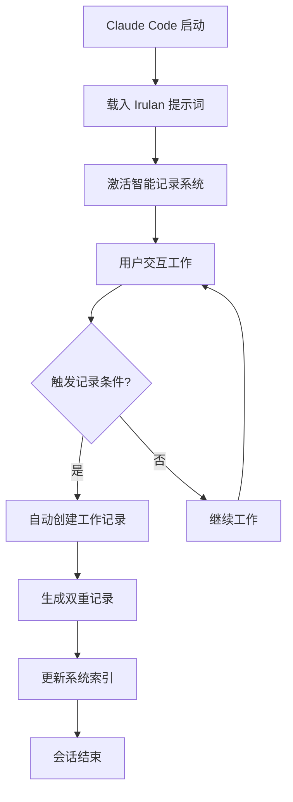

# 🤖 Irulan智能工作日志系统 / Irulan Intelligent Work Journal System

[](LICENSE)
[](CHANGELOG.md)
[](#)

> "Think clearly, build beautifully, live meaningfully"  
> 清晰思考，优雅创造，有意义地生活

## 📖 项目简介 / Project Overview

**中文简介**

Irulan智能工作日志系统是一个纯粹的个人思维记录工具。受《沙丘》中Princess Irulan启发，专注于真实记录个人的思考过程和认知成长。**开源只是为了有个地方存储，不考虑任何商业或影响力目的，只是静静地记录记录本身。**

**English Overview**

The Irulan Intelligent Work Journal System is a pure personal thinking recording tool. Inspired by Princess Irulan from "Dune," it focuses on authentically documenting personal thinking processes and cognitive growth. **Open source is simply for having a place to store, without considering any commercial or influence purposes, just quietly recording the records themselves.**

---

## 🚀 核心特性 / Core Features

### 🧠 Deep Thought子模块 - Irulan系统优化专用
*受《银河系漫游指南》深思计算机启发*

**核心使命**: 专门用于思考Irulan智能工作日志系统本身的改进和优化

- **系统改进思考**: 长期追踪如何让Irulan记录工具更完善
- **记录方法优化**: 深度思考什么样的记录方式最有效
- **工具演进规划**: 规划Irulan系统的长期发展方向
- **使用体验提升**: 思考如何让记录过程更自然流畅

**Deep Thought Submodule Features:**
- **System Improvement Thinking**: Long-term tracking of how to improve the Irulan recording tool
- **Recording Method Optimization**: Deep thinking about what recording methods are most effective
- **Tool Evolution Planning**: Planning the long-term development direction of the Irulan system
- **Usage Experience Enhancement**: Thinking about how to make the recording process more natural and smooth

### 📝 Irulan核心记录功能
- **实时工作记录**: 记录具体的工作过程和思考洞察
- **日常总结**: 系统性整理当日的重要思维成果
- **思维洞察**: 捕捉和表达重要的认知突破
- **模板支持**: 提供标准化的记录模板和格式

---

## 🏗️ 系统架构 / System Architecture

```
IrulanDiary/
├── Irulan智能工作日志系统v3.3.md        # 【主系统文档】本规范说明
├── 🧠 长期思考追踪/                      # 【Deep Thought子模块】
│   ├── Deep-Questions-Registry.md        # Deep Questions注册中心
│   ├── 2025-个人日志记录方法论/           # 专门思考Irulan系统的改进
│   ├── 2025-长期思考日志化/               # 思考如何优化记录过程
│   ├── 🌟 系统使用指南.md                # Deep Thought使用指南
│   └── 📋 模板/                          # Deep Thought相关模板
├── YYYY-MM-DD/                           # 【核心记录区】按日期分层
│   ├── HH-MM-具体工作记录.md              # 实时工作洞察记录
│   ├── YYYY-MM-DD-工作日志.md             # 当日系统性总结
│   ├── YYYY-MM-DD-每日微博.md             # 当日思维洞察
│   └── YYYY-MM-DD-Daily-Journal.md       # 英文版工作日志
└── Templates/                            # 【支持模块】各类记录模板
```

## 🛠️ 安装使用 / Installation & Usage

### 环境要求 / Requirements
- [Obsidian](https://obsidian.md/) v1.0.0+
- 支持Markdown和Canvas文件
- 推荐插件：Mermaid图表支持

### 快速开始 / Quick Start

1. **克隆项目 / Clone Repository**
```bash
git clone https://github.com/Yaxuan42/IrulanDiary.git
cd IrulanDiary
```

2. **导入Obsidian / Import to Obsidian**
- 在Obsidian中打开项目文件夹作为vault
- 确保启用了Canvas和Mermaid插件支持

3. **开始使用 / Start Using**
- 阅读 `Irulan智能工作日志系统v3.3.md` 了解系统核心理念
- 使用Templates文件夹中的模板开始日常记录
- 如果需要优化系统，可查看Deep Thought子模块

### 使用流程 / Usage Workflow


---

## 📚 核心方法论 / Core Methodology

### Clear Thinking框架
```
问题识别 → 信息收集 → 多角度分析 → 方案生成 → 决策评估 → 行动计划
    ↓           ↓           ↓            ↓           ↓           ↓
  本质是什么？  缺什么信息？  还有什么可能？  哪个最优？   如何验证？   下一步？
```

### 四维知识体系
```
产品设计 × 技术开发 × 商业思考 × 个人成长
    ↓           ↓           ↓           ↓
  创新思维    系统架构     价值创造     持续进化
```

---

## 🤖 Claude Code 集成指南 / Claude Code Integration Guide

### Claude Code 自动化操作 / Automated Operations
基于系统提示词 `Irulan – 智能助理系统提示词v3.0.md`，Claude Code 支持以下自动化功能：

#### 智能记录触发 / Intelligent Recording Triggers
Claude Code 会在以下情况自动创建工作记录：
- **重大突破时刻** - 技术架构创新、产品设计突破、商业模式洞察
- **复杂问题解决** - 系统性思考过程、多维度分析结果
- **跨界知识融合** - 设计×技术×商业×成长的创新应用
- **认知跃迁时刻** - 第一性原理发现、思维模式升级
- **系统性工作完成** - 项目里程碑、知识体系建设

#### 核心命令集 / Core Commands

**1. 启动Irulan系统 / Initialize Irulan System**
```bash
# Claude Code 会话开始时自动执行
载入系统提示词：Irulan – 智能助理系统提示词v3.0.md
激活 Clear Thinking 框架
连接 Knowledge Base 知识体系
```

**2. 创建工作记录 / Create Work Record**
```bash
# 自动触发条件：完成重要工作后
创建实时工作记录：YYYY-MM-DD/HH-MM-具体工作记录.md
生成当日总结：YYYY-MM-DD/YYYY-MM-DD-工作日志.md
生成思维洞察：YYYY-MM-DD/YYYY-MM-DD-每日微博.md
```

**3. Deep Thought 子模块操作 / Deep Thought Submodule Operations**
```bash
# 系统改进思考
分析系统使用效果
提出优化建议
更新改进计划
记录到：🧠 长期思考追踪/2025-个人日志记录方法论/
```

### 集成工作流程 / Integration Workflow


### 质量控制标准 / Quality Control Standards
- **记录完整性检查** - 确保 YAML 前置属性完整
- **链接有效性验证** - 检查内部链接和引用
- **格式一致性保证** - 统一 Markdown 格式规范
- **内容价值评估** - 基于 Clear Thinking 框架评估记录质量

---

## 🔗 系统集成指南 / System Integration Guide

### 与Knowledge Base集成 / Knowledge Base Integration

#### 设计知识体系集成
```yaml
IrulanDiary/ ↔ Knowledge Base/Design Knowledge/
├── 工作记录自动关联相关设计原则
├── 设计思考过程记录到工作日志
├── Apple Design指导界面设计记录
└── Material Design规范应用到模板设计
```

**集成场景示例**:
- 进行产品设计时，自动关联 `Apple Design/` 和 `Laws of UX/` 相关知识
- UI/UX工作完成后，记录中自动引用相关设计原则
- 设计决策过程记录时，链接到对应的理论基础

#### 技术知识体系集成 (规划中)
```yaml
IrulanDiary/ ↔ Knowledge Base/Tech Knowledge/
├── 技术方案设计记录
├── 架构决策思考过程
├── 编程实践经验沉淀
└── 技术学习成果追踪
```

#### 商业知识体系集成 (规划中)
```yaml
IrulanDiary/ ↔ Knowledge Base/Business Knowledge/
├── 商业决策分析记录
├── 市场洞察思考过程
├── 战略规划讨论记录
└── 商业模式创新思考
```

### 与版本控制系统集成 / Version Control Integration

#### Git集成最佳实践
```bash
# 推荐的Git工作流程
git add IrulanDiary/YYYY-MM-DD/
git commit -m "Add daily work records and insights for YYYY-MM-DD

🎯 Key achievements:
- [具体成果]
- [重要洞察]

🧠 Deep thoughts:
- [深度思考总结]

📊 System improvements:
- [系统优化建议]

Co-authored-by: Irulan <ai-assistant@claude.ai>"
```

#### 分支管理策略
```bash
main           # 主分支 - 稳定的记录版本
├── daily/*    # 日常记录分支
├── projects/* # 项目相关记录分支
└── system/*   # 系统优化分支
```

### 与时间管理系统集成 / Time Management Integration

#### 番茄工作法集成
```yaml
工作周期记录:
  25分钟专注 → 5分钟记录洞察 → 累积到工作日志
  每4个番茄 → 生成阶段性总结
  一天结束 → 自动整合为完整工作日志
```

#### GTD系统集成
```yaml
收集箱 → 每日微博(快速捕捉)
处理阶段 → 实时工作记录(深度分析)
整理阶段 → 工作日志(系统整理)
回顾阶段 → Deep Thought子模块(系统优化)
```

### 与笔记管理系统集成 / Note Management Integration

#### Obsidian插件生态
```yaml
推荐插件配置:
├── Calendar Plugin → 日历视图浏览工作日志
├── Dataview Plugin → 自动生成统计报表
├── Templater Plugin → 高级模板自动化
├── Tag Wrangler → 标签管理优化
└── Graph Analysis → 知识网络可视化
```

#### Notion等其他系统
```yaml
数据同步策略:
├── 使用Markdown格式确保跨平台兼容
├── YAML前置属性支持元数据导入
├── 定期导出为通用格式备份
└── API集成实现数据双向同步
```

### 与AI工具链集成 / AI Toolchain Integration

#### ChatGPT集成
```yaml
工作流程:
  ChatGPT对话 → 重要洞察提取 → Irulan记录整理
  语音输入 → GPT转录整理 → Claude Code格式化
  创意讨论 → 结构化记录 → 知识库关联
```

#### Claude Code深度集成
```yaml
自动化流程:
  工作完成触发 → Claude Code评估价值 → 自动生成记录
  模板智能选择 → 内容结构优化 → 链接关系建立
  质量检查 → 格式标准化 → 知识网络更新
```

### 与生产力工具集成 / Productivity Tools Integration

#### 日历应用集成
```yaml
时间块记录:
  日历事件 ↔ 工作记录时间戳
  会议记录 ↔ 实时工作记录
  项目时间 ↔ 效能数据分析
```

#### 任务管理工具
```yaml
任务完成触发记录:
  Todoist/Any.do → 任务完成 → 自动记录触发
  项目里程碑 → 深度复盘记录
  习惯追踪 → 个人成长维度记录
```

### 数据备份与同步 / Backup and Sync

#### 多端同步策略
```yaml
同步方案:
├── Obsidian Sync (官方) - 实时同步，版本历史
├── iCloud/Google Drive - 文件夹同步备份
├── Git Repository - 版本控制，协作支持
└── 定期导出 - 防灾备份，格式转换
```

#### 隐私保护措施
```yaml
隐私层级:
├── 个人敏感内容 → 本地加密存储
├── 工作相关记录 → 企业级同步方案
├── 公开分享内容 → GitHub等开放平台
└── 学习成果记录 → 知识社区分享
```

---

## 🎯 使用场景 / Use Cases

### 适用人群 / Target Users
- **思考者**: 任何希望深度记录思考过程的人
- **学习者**: 希望追踪认知成长的个人
- **创作者**: 需要捕捉创意和灵感的人
- **研究者**: 进行长期深度思考的人
- **记录者**: 相信记录本身价值的人

### 典型场景 / Typical Scenarios
1. **深度思考记录**: 复杂问题的思考过程完整记录
2. **创意捕捉保存**: 转瞬即逝的灵感和想法的及时记录
3. **学习成长追踪**: 个人认知发展和知识积累的历程记录
4. **决策过程分析**: 重要选择的推理过程和结果追踪
5. **纯粹记录存档**: 为了记录本身价值的思维历程保存

---

## 📝 实际案例示例 / Real Examples

### 实时工作记录示例 / Work Record Example
```markdown
---
title: "14-30-Claude Code集成架构设计"
date: 2025-07-29
type: work-record
tags: [系统设计, AI集成, 架构优化]
status: completed
---

# 14:30 Claude Code集成架构设计

## 🎯 工作目标
设计Irulan系统与Claude Code的深度集成方案，实现智能记录的自动化触发。

## 🧠 Clear Thinking 分析

### 问题本质
- **核心问题**: 如何让AI系统自主判断记录价值并自动生成结构化文档？
- **关键约束**: 保持记录的纯粹性，避免为了自动化而牺牲思考深度

### 多维度思考
- **技术维度**: 基于提示词的触发机制 vs 基于用户行为的触发机制
- **用户体验**: 自动化便利性 vs 记录控制感
- **内容质量**: 批量生成 vs 精心筛选

### 方案设计
1. **智能触发条件**: 定义5类自动记录场景（重大突破、复杂问题解决等）
2. **双重记录机制**: 工作日志（结构化） + 每日微博（自由表达）
3. **质量控制**: Clear Thinking框架自动评估记录价值

## 💡 关键洞察
- 自动化的目的是降低记录门槛，而非替代思考本身
- 技术服务于思维，而非让思维适应技术限制

## 🔗 知识连接
- 关联: [[Irulan智能工作日志系统v3.3]]
- 应用: [[Knowledge Base/Design Knowledge/Apple Design]]
- 延伸: [[🧠 长期思考追踪/2025-个人日志记录方法论]]

## ⏭️ 下一步行动
- [ ] 完善自动触发逻辑的具体实现
- [ ] 测试不同场景下的记录质量
- [ ] 优化模板结构提升可读性
```

### 每日微博示例 / Daily Micro-blog Example
```markdown
---
title: "2025-07-29-每日微博"
date: 2025-07-29
type: daily-insights
tags: [思维洞察, 系统优化, 认知突破]
---

# 2025-07-29 思维洞察

## 🔥 今日最大突破
发现了一个重要认知：**记录系统的自动化不应该替代思考的主动性**。

Claude Code的集成让我意识到，真正有价值的不是自动生成多少文档，而是这个过程中我们对思考本身的审视和提升。就像Irulan记录帝国历史，重要的不是记录的数量，而是史学家的洞察力。

## 🤔 深度思辨
今天设计自动触发机制时陷入了一个矛盾：
- 想要更多自动化 → 减少记录门槛 → 可能降低思考质量
- 保持手动控制 → 确保记录价值 → 可能错过重要洞察

最终的解决方案是：**让AI成为思维伙伴，而非思维替代者**。

## ⚡ 技术灵感
Mermaid流程图真的太好用了！能够将复杂的集成逻辑可视化，让整个系统架构一目了然。这种"思维的可视化"或许也应该成为日常记录的一部分。

## 🎯 明日重点
继续优化README.md，特别是实际案例部分。要让其他人能够快速理解这个系统的价值，而不仅仅是功能。

*记录时间: 22:45 | 心情: 满足且期待 | 状态: 思维活跃*
```

### 工作日志示例 / Work Journal Example
```markdown
---
title: "2025-07-29-工作日志"
date: 2025-07-29
type: daily-summary
tags: [每日总结, 系统建设, 文档优化]
status: completed
---

# 2025-07-29 工作日志

[[2025-07-28-工作日志|⬅️ 昨天]] | [[2025-07-30-工作日志|明天 ➡️]]

## 📊 四维价值矩阵

### 🎨 产品设计维度 (⭐⭐⭐⭐)
- **主要成果**: 完成README.md的Claude Code集成指南设计
- **设计思考**: 用户视角下的系统介绍逻辑优化
- **收获**: 技术文档也需要产品思维，要考虑用户的认知路径

### 💻 技术开发维度 (⭐⭐⭐⭐⭐)
- **主要成果**: 设计了完整的AI集成架构和自动化触发机制
- **技术洞察**: Mermaid图表 + YAML前置属性 + 模板系统的组合威力
- **难点攻克**: 解决了自动化与控制感之间的平衡问题

### 💼 商业思考维度 (⭐⭐⭐)
- **商业价值**: 开源项目的纯粹记录理念可能是差异化优势
- **市场洞察**: 个人知识管理工具市场需要更多"纯粹"的选择
- **思考**: 如何在开源的同时保持项目的初心和价值观

### 🌱 个人成长维度 (⭐⭐⭐⭐)
- **认知突破**: 深刻理解了"记录本身就是价值"的哲学
- **能力提升**: 系统性文档写作能力得到锻炼
- **思维模式**: 学会用结构化的方式思考复杂问题

## 🔄 系统改进洞察
- **模板优化**: 发现当前模板在实际使用中的便利性问题
- **结构调整**: README.md需要更多实际案例来降低理解门槛
- **流程完善**: 自动化触发条件需要更精确的定义

## 🔗 知识网络更新
- 新建连接：Claude Code集成 ↔ Irulan核心系统
- 强化路径：技术实现 ↔ 哲学理念 ↔ 用户体验
- 待探索：AI辅助记录与人工精选的最佳平衡点

## 💡 明日Clear Thinking重点
1. **第一性原理检查**: 重新审视自动化的必要性和边界
2. **用户体验优化**: 从新手视角完善使用指南
3. **系统压力测试**: 在实际使用中验证设计的合理性

## 📈 效能数据
- **专注时间**: 6小时 (14:00-20:00)
- **深度工作**: 4小时 (架构设计+文档写作)
- **创意产出**: 3个重要洞察 + 1套完整方案
- **满意度**: 9/10 (非常满意今天的思考深度)

---
*"今天的记录让我更加确信，真正的智能系统应该增强人的思考，而不是替代人的思考。"*
```

---

## 📈 系统价值 / System Value

### 记录本身的价值 / Value of Recording Itself
- **思维的外化**: 将内在思考过程转化为可见的记录
- **认知的沉淀**: 重要洞察和突破的永久保存
- **成长的见证**: 个人思维发展历程的真实记录
- **思考的延续**: 过往思考为未来思考提供基础

### 纯粹的收益 / Pure Benefits
- 培养深度思考的习惯
- 提升问题分析的系统性
- 增强创意捕捉的敏感度
- 建立个人思维的完整档案

---

## 📊 性能分析与指标 / Performance Analytics & Metrics

### 系统使用统计 / Usage Statistics

#### 记录频率分析 / Recording Frequency Analysis
```yaml
日常记录模式:
├── 实时工作记录: 平均 3-5 次/天 (高价值工作触发)
├── 每日微博: 1 次/天 (思维洞察汇总)
├── 工作日志: 1 次/天 (系统性总结)
└── Deep Thought: 1-2 次/周 (系统改进思考)

记录时长分布:
├── 快速洞察记录: 5-10 分钟
├── 深度工作记录: 15-30 分钟
├── 每日总结: 20-40 分钟
└── 系统性思考: 1-2 小时
```

#### 内容质量指标 / Content Quality Metrics
```yaml
质量评估维度:
├── 思考深度: 基于Clear Thinking框架的分析完整性
├── 知识关联: 与Knowledge Base的链接密度
├── 实用价值: 可操作洞察和建议的数量
└── 持续性: 长期追踪和迭代的完成度

质量得分计算:
思考深度 (40%) + 知识关联 (25%) + 实用价值 (25%) + 持续性 (10%) = 总体质量分
```

### 认知发展追踪 / Cognitive Development Tracking

#### 四维能力发展矩阵 / Four-Dimensional Capability Matrix
```yaml
产品设计能力追踪:
├── 设计思维应用频率: 月度统计
├── 用户体验洞察深度: 质性分析
├── 界面设计决策质量: 同行评估
└── 设计系统理解程度: 知识图谱完整性

技术开发能力追踪:
├── 架构设计复杂度: 项目难度提升
├── 问题解决效率: 时间成本降低
├── 技术选型准确性: 回顾性评估
└── 代码质量提升: 静态分析指标

商业思考能力追踪:
├── 市场分析准确性: 预测vs实际对比
├── 商业模式理解: 案例分析深度
├── 战略思维发展: 长期规划能力
└── 价值创造洞察: 实际业务影响

个人成长能力追踪:
├── 学习效率提升: 知识吸收速度
├── 思维模式升级: 认知框架演进
├── 习惯养成进度: 行为改变追踪
└── 生活平衡指数: 多维度满意度
```

### 效率优化分析 / Efficiency Optimization Analysis

#### 时间投入产出分析 / Time Investment ROI
```yaml
投入时间统计:
├── 记录创建时间: 日均 60-90 分钟
├── 内容整理时间: 周均 2-3 小时
├── 系统维护时间: 月均 4-6 小时
└── 深度回顾时间: 季均 8-12 小时

产出价值评估:
├── 决策质量提升: 基于历史记录的对比分析
├── 问题解决速度: 相似问题处理时间对比
├── 创新洞察产生: 跨界连接和创意数量
└── 长期发展加速: 能力提升曲线斜率
```

#### 系统性能优化 / System Performance Optimization
```yaml
技术性能指标:
├── 文件搜索速度: <500ms (目标)
├── 链接响应时间: <100ms (目标)
├── 大文档加载: <2s (目标)
└── 同步延迟: <5s (目标)

用户体验指标:
├── 记录创建便利性: 5步内完成 (目标)
├── 信息查找效率: 3次点击内到达 (目标)
├── 模板使用满意度: >90% (目标)
└── 系统稳定性: >99.5% 正常运行时间 (目标)
```

### 数据驱动改进 / Data-Driven Improvements

#### 使用模式识别 / Usage Pattern Recognition
```yaml
高效记录时段识别:
├── 晨间思考(7-9am): 创意洞察高峰
├── 午后复盘(14-16pm): 深度分析最佳
├── 晚间总结(20-22pm): 系统整理集中
└── 周末回顾: 长期规划和系统优化

记录触发条件优化:
├── 重大突破阈值: 基于历史价值评估调整
├── 问题复杂度判断: 自动化程度vs手动控制平衡
├── 知识融合时机: 跨域连接的最佳触发点
└── 系统改进频率: 基于实际使用体验调整
```

#### 持续改进机制 / Continuous Improvement Framework
```yaml
改进循环周期:
├── 日度微调: 基于当日使用体验
├── 周度优化: 基于一周数据分析
├── 月度重构: 基于系统使用统计
└── 季度升级: 基于长期发展需求

改进决策矩阵:
├── 用户体验影响 (High/Medium/Low)
├── 技术实现难度 (Easy/Medium/Hard)
├── 价值产出预期 (High/Medium/Low)
└── 优先级计算: 体验影响 × 价值预期 / 实现难度
```

### 成果展示与分析 / Results Display & Analysis

#### 可视化数据看板 / Visual Dashboard
```yaml
核心指标展示:
├── 记录数量趋势图: 展示日常记录活跃度
├── 质量分数变化: 追踪思考深度发展
├── 知识网络增长: 可视化连接关系扩展  
└── 能力发展雷达图: 四维能力平衡状况

深度分析报告:
├── 月度成长报告: 详细的进展分析和洞察总结
├── 季度能力评估: 全面的能力发展和目标调整
├── 年度思维进化: 认知模式和思维框架的演进历程
└── 系统贡献价值: 记录系统对个人发展的具体影响
```

---

## 🔄 版本历史 / Version History

- **v1.0** (2025-06) - 基础工作日志系统，专注记录功能
- **v2.0** (2025-07) - 增加思维洞察和微博功能
- **v3.0** (2025-07) - 集成Clear Thinking方法论和四维知识体系
- **v3.1** (2025-07) - 集成科幻智能系统三件套
- **v3.2** (2025-07) - 系统聚焦优化，移除决策推理链
- **v3.3** (2025-07) - **架构重新定位：Irulan为主体，Deep Thought为子模块**，文件夹更名为IrulanDiary

---

## 🤝 关于分享 / About Sharing

这个项目开源是为了纯粹的存储和备份，而非寻求贡献或推广。

### 如果你发现了这个项目 / If You Found This Project
- 欢迎使用和参考，但请理解这主要是个人记录工具
- 如果对你有帮助，那是记录自然分享的美好结果
- 不需要Star或推广，只需要专注于你自己的记录和思考

### 纯粹的记录理念 / Pure Recording Philosophy
- 记录是为了思考本身，不是为了展示
- 开源是为了安全存储，不是为了影响力
- 分享是自然结果，不是刻意目的

---

## 🔧 故障排除 / Troubleshooting

### 常见问题解决 / Common Issues Resolution

#### 1. Claude Code 集成问题 / Claude Code Integration Issues

**问题**: Claude Code 无法正确载入 Irulan 系统提示词
```bash
症状: AI 回应不符合 Irulan 角色定位，缺少 Clear Thinking 分析
解决方案:
1. 确认 `Irulan – 智能助理系统提示词v3.0.md` 文件存在
2. 检查文件路径和权限
3. 重新启动 Claude Code 会话
4. 手动读取提示词文件进行验证
```

**问题**: 自动记录触发失败
```bash
症状: 完成重要工作后未自动生成记录文件
解决方案:
1. 检查触发条件是否满足（参考智能记录触发标准）
2. 确认目标文件夹 YYYY-MM-DD/ 存在
3. 验证模板文件完整性
4. 手动创建记录文件作为备用方案
```

#### 2. Obsidian 配置问题 / Obsidian Configuration Issues

**问题**: Canvas 文件无法正常显示
```bash
症状: .canvas 文件打开错误或格式异常
解决方案:
1. 更新 Obsidian 到最新版本
2. 检查 Canvas 插件是否启用
3. 验证 JSON 格式正确性
4. 重新创建损坏的 Canvas 文件
```

**问题**: Mermaid 图表渲染失败
```bash
症状: 流程图和架构图无法显示
解决方案:
1. 安装 Mermaid 插件
2. 检查图表语法正确性
3. 清理 Obsidian 缓存
4. 使用在线 Mermaid 编辑器验证语法
```

#### 3. 文件结构问题 / File Structure Issues

**问题**: 链接断开或无法跳转
```bash
症状: [[内部链接]] 显示为红色或无法点击
解决方案:
1. 检查目标文件是否存在
2. 验证文件名和路径正确性
3. 使用相对路径替代绝对路径
4. 重建损坏的链接关系
```

**问题**: YAML 前置属性解析错误
```bash
症状: 文件元数据无法正确显示
解决方案:
1. 检查 YAML 语法和缩进
2. 确保 --- 分隔符正确
3. 验证特殊字符转义
4. 使用 YAML 验证工具检查格式
```

#### 4. 性能优化问题 / Performance Optimization Issues

**问题**: 大量文件导致 Obsidian 卡顿
```bash
症状: 打开文件夹或搜索响应缓慢
解决方案:
1. 定期清理不必要的文件
2. 关闭不需要的插件
3. 使用文件夹归档旧记录
4. 优化搜索索引设置
```

### 紧急恢复方案 / Emergency Recovery Plan

#### 数据备份恢复 / Data Backup Recovery
```bash
1. 立即停止当前操作，避免覆盖数据
2. 检查 .obsidian/ 配置文件夹是否完整
3. 从最近的备份恢复丢失文件
4. 重建损坏的链接和索引
5. 验证恢复后的数据完整性
```

#### 系统重置流程 / System Reset Process
```bash
1. 导出重要记录和配置
2. 清理损坏的配置文件
3. 重新初始化 Obsidian vault
4. 重新导入核心文件和模板
5. 测试系统功能正常性
```

### 获取帮助 / Getting Help

- **技术问题**: 在 [GitHub Issues](https://github.com/Yaxuan42/IrulanDiary/issues) 中创建问题报告
- **使用疑问**: 查看 [GitHub Discussions](https://github.com/Yaxuan42/IrulanDiary/discussions) 或创建讨论
- **Obsidian 相关**: 参考 [Obsidian 官方文档](https://help.obsidian.md/)
- **Claude Code 相关**: 查看 [Claude Code 文档](https://docs.anthropic.com/en/docs/claude-code)

---

## 📄 许可证 / License

本项目采用 MIT 许可证 - 详见 [LICENSE](LICENSE) 文件。

This project is licensed under the MIT License - see the [LICENSE](LICENSE) file for details.

---

## 🙏 致谢 / Acknowledgments

### 科幻灵感来源 / Sci-Fi Inspirations
- **《沙丘》** - Princess Irulan的史学记录精神（核心系统）
- **《银河系漫游指南》** - Deep Thought计算机的耐心思考哲学（子模块）

### 技术致谢 / Technical Acknowledgments
- [Obsidian](https://obsidian.md/) - 优秀的知识管理平台
- [Mermaid](https://mermaid-js.github.io/) - 强大的图表绘制工具
- [Markdown](https://www.markdownguide.org/) - 简洁的文档格式

---

## 📞 联系方式 / Contact

- **项目主页**: [https://github.com/Yaxuan42/IrulanDiary](https://github.com/Yaxuan42/IrulanDiary)
- **问题反馈**: [GitHub Issues](https://github.com/Yaxuan42/IrulanDiary/issues)
- **功能建议**: [GitHub Discussions](https://github.com/Yaxuan42/IrulanDiary/discussions)

---

## 🌟 Star History

如果这个项目对你有帮助，请给我们一个 ⭐！

If this project helps you, please give us a ⭐!

[](https://star-history.com/#Yaxuan42/IrulanDiary&Date)

---

*"In the beginning was the Word, and the Word was with Data, and the Word was Data."*  
—— Irulan, Digital Age Imperial Diary

**系统格言 / System Motto**: *Record truly, think deeply, grow continuously* 📚