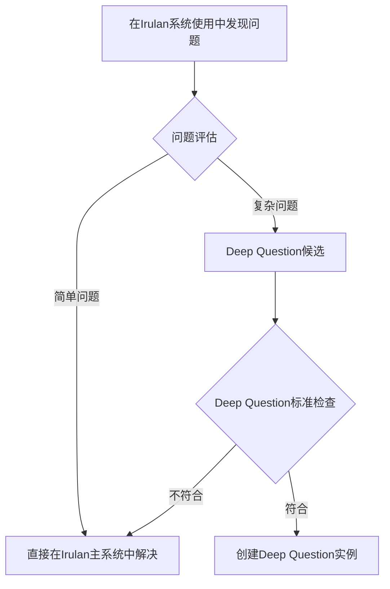

# 🧠 Deep Thought子模块使用流程与实例生成指南

> *"The value of a tool is not in its complexity, but in how easily it can be used to create value."*  
> —— Deep Thought, Irulan System Optimization Module

## 📖 核心使用原则

### 🎯 使用前置条件
在使用Deep Thought子模块之前，必须确认：
- [ ] **主系统优先**: 已经在积极使用Irulan主系统进行日常记录
- [ ] **问题来源**: 发现的问题确实来自Irulan系统的实际使用体验
- [ ] **改进导向**: 问题的解决将直接改善Irulan系统的记录效果
- [ ] **时间跨度**: 问题需要数月以上的持续思考才能深入理解

### ⚠️ 核心约束
**绝对约束**:
- 🚫 **禁止通用化**: 不能思考与Irulan系统无关的一般性问题
- 🚫 **禁止独立化**: 不能让Deep Thought脱离Irulan主系统独立发展
- 🚫 **禁止复杂化**: 不能为了深度思考而思考，必须为了实际改进

**积极约束**:
- ✅ **专注Irulan**: 所有思考都围绕如何改进Irulan工作日志系统
- ✅ **服务主系统**: 思考成果必须能转化为Irulan系统的实际改进
- ✅ **持续应用**: 定期将思考成果应用到Irulan系统的实际使用中

---

## 🚀 标准使用流程

### Phase 1: 问题识别与评估


**问题识别触发场景**:
- 📝 **记录效果不佳**: Irulan记录没有促进思维成长
- 🔄 **使用体验问题**: Irulan系统使用过程不够自然流畅
- 🎯 **功能需求变化**: Irulan系统需要调整或新增功能
- 📊 **效果评估发现**: 定期评估发现Irulan系统的不足

**Deep Question标准检查清单**:
- [ ] 这个问题**专门关于Irulan工作日志系统本身**？
- [ ] 这个问题**需要3个月以上的持续思考**？
- [ ] 这个问题的解决将**显著改善Irulan系统**？
- [ ] 这个问题**不能通过简单调整解决**？

### Phase 2: Deep Question实例创建

#### 2.1 创建核心实例文件
**必须创建的文件**:
1. **主问题文件**: 使用[[📋 模板/新Deep-Question创建模板.md]]
2. **问题演进史**: 使用[[📋 模板/Irulan系统问题演进史模板.md]]
3. **专属文件夹**: `YYYY-问题关键词/`

**创建步骤**:
```bash
# 1. 创建问题文件夹
mkdir "YYYY-[问题关键词]"

# 2. 基于模板创建主问题文件
cp "📋 模板/新Deep-Question创建模板.md" "YYYY-[问题关键词]/[问题标题].md"

# 3. 创建问题演进史
cp "📋 模板/Irulan系统问题演进史模板.md" "YYYY-[问题关键词]/问题定义演进史.md"

# 4. 在Deep-Questions-Registry.md中注册
```

#### 2.2 注册到系统中心
在[[Deep-Questions-Registry.md]]中添加:
```markdown
### X. 🎯 [问题标题]
**问题文件夹**: `YYYY-问题关键词/`
- **开始日期**: YYYY-MM-DD
- **预期周期**: X个月
- **当前阶段**: Phase 1 - 问题定义与分析
- **完成度**: 5% █░░░░░░░░░░░░░░░░░░░░░░░░░░░░░
- **最近更新**: YYYY-MM-DD - 创建Deep Question
- **核心子问题**: 
  - [与Irulan系统相关的具体子问题1]
  - [与Irulan系统相关的具体子问题2]
- **当前思考焦点**: [当前专注的Irulan系统改进方向]
```

### Phase 3: 持续思考与迭代

#### 3.1 周度思考更新
**每周必做任务**:
- [ ] **基于Irulan使用体验**更新思考进展
- [ ] **记录新发现的问题**或改进机会
- [ ] **评估当前思考方向**是否偏离Irulan系统优化主题
- [ ] **更新Deep-Questions-Registry.md**中的进展

**周度更新模板**:
```markdown
## YYYY-MM-DD 周度思考更新

### 本周Irulan系统使用发现
- [在使用Irulan系统过程中的新发现]

### 思考进展
- [对问题理解的深化]
- [新的改进想法]

### 下周重点
- [下周重点思考的方向]
```

#### 3.2 月度深度回顾
**每月必做任务**:
- [ ] **评估问题演进**: 问题理解是否有重大变化？
- [ ] **更新演进史**: 记录问题定义的重要变化
- [ ] **应用改进成果**: 将成熟想法应用到Irulan系统实际使用中
- [ ] **效果验证**: 验证改进对Irulan系统的实际效果

**月度回顾模板**:
```markdown
## YYYY-MM 月度Deep Question回顾

### 问题理解演进
- [问题理解是否有重大变化]
- [是否需要更新问题演进史]

### 改进成果应用
- [本月应用到Irulan系统的改进]
- [改进效果评估]

### 下月计划
- [下月重点思考方向]
- [计划验证的假设]
```

### Phase 4: 成果应用与验证

#### 4.1 改进方案转化
**从思考到应用的标准流程**:
1. **方案成熟度评估**: 改进想法是否足够具体可操作？
2. **Irulan系统影响评估**: 改进对主系统的影响和风险？
3. **小范围试验**: 在Irulan系统使用中试验改进方案
4. **效果验证**: 评估改进是否真正提升了记录效果
5. **正式应用**: 将验证有效的改进正式集成到Irulan系统中

#### 4.2 子模块价值评估
**定期评估Deep Thought子模块的价值**:
- 📊 **改进贡献**: 为Irulan系统提供了多少实际改进？
- 🎯 **效果验证**: 改进是否真正提升了Irulan系统的记录效果？
- ⚡ **效率评估**: 深度思考的时间投入是否值得？
- 🔄 **持续价值**: 子模块是否持续为主系统创造价值？

---

## 📋 实例生成标准操作程序

### 当前活跃实例示范

#### 实例1: 个人日志记录方法论
**问题**: 如何让Irulan工作日志系统真正成为有效的思维记录工具？
**文件夹**: `2025-个人日志记录方法论/`
**实例文件**:
- [[2025-个人日志记录方法论/问题定义演进史.md]] ✅ 已创建
- `思考里程碑.md` - 待创建
- `月度思考总结/` - 文件夹待创建
- `灵感收集.md` - 待创建

#### 实例2: Deep Thought子模块服务机制
**问题**: Deep Thought子模块如何更好地服务Irulan主系统？
**文件夹**: `2025-长期思考日志化/`
**实例文件**:
- [[2025-长期思考日志化/问题定义演进史.md]] ✅ 已创建
- `服务机制设计.md` - 待创建
- `约束检查清单.md` - 待创建
- `月度效果评估/` - 文件夹待创建

### 新实例创建SOP

**标准操作程序**:
1. **前置检查** (5分钟)
   - 确认问题符合Deep Question标准
   - 确认问题专门关于Irulan系统改进

2. **文件夹创建** (2分钟)
   ```bash
   mkdir "YYYY-[问题关键词]"
   ```

3. **核心文件创建** (15分钟)
   - 基于模板创建主问题文件
   - 创建问题演进史文件
   - 填写基本信息和初始思考

4. **系统注册** (5分钟)
   - 在Deep-Questions-Registry.md中注册
   - 更新统计数据

5. **初始思考记录** (20分钟)
   - 记录问题发现过程
   - 记录初步洞察和假设
   - 设定初步的思考计划

**质量检查清单**:
- [ ] 问题定义清晰且专门关于Irulan系统？
- [ ] 文件夹命名规范且有意义？
- [ ] 已在注册中心正确注册？
- [ ] 初始思考记录完整？

---

## 🔄 维护与优化流程

### 日常维护任务

#### 每日 (使用Irulan系统时)
- [ ] 留意Irulan系统使用中的问题和改进机会
- [ ] 及时记录与Deep Questions相关的想法
- [ ] 评估新发现是否需要更新现有思考

#### 每周 (周日晚)
- [ ] 更新所有活跃Deep Questions的进展
- [ ] 评估思考方向是否偏离Irulan系统主题
- [ ] 规划下周的重点思考方向

#### 每月 (月末)
- [ ] 深度回顾所有Deep Questions
- [ ] 更新问题演进史
- [ ] 应用成熟的改进方案到Irulan系统
- [ ] 评估Deep Thought子模块的整体价值

#### 每季 (季度末)
- [ ] 评估是否有Deep Questions可以完结
- [ ] 检查子模块是否存在喧宾夺主倾向
- [ ] 调整Deep Questions的优先级和方向
- [ ] 优化子模块的使用流程

### 质量控制机制

#### 偏离检查
**每月检查清单**:
- [ ] 当前所有Deep Questions都专门关于Irulan系统改进？
- [ ] 思考成果能够转化为Irulan系统的实际改进？
- [ ] Deep Thought子模块没有脱离主系统独立发展？
- [ ] 子模块的使用没有增加不必要的复杂度？

#### 价值验证
**季度价值评估**:
- 📊 **量化指标**: Deep Thought为Irulan系统提供了多少改进？
- 🎯 **质量指标**: 改进是否真正提升了Irulan记录效果？
- ⚡ **效率指标**: 时间投入与价值产出的比例如何？
- 🔄 **持续性**: 子模块是否能持续为主系统创造价值？

---

## 📞 故障排除与优化

### 常见问题与解决方案

#### ❌ 问题1: Deep Question偏离Irulan系统主题
**症状**: 思考内容与Irulan系统改进无关
**解决方案**: 
1. 立即停止当前思考
2. 重新审视问题定义
3. 调整思考方向或关闭问题

#### ❌ 问题2: 思考成果无法应用到实际改进
**症状**: 思考很深入但无法转化为具体改进
**解决方案**:
1. 简化思考复杂度
2. 聚焦于可操作的具体改进
3. 设定明确的应用时间表

#### ❌ 问题3: Deep Thought使用过度
**症状**: 花费过多时间在深度思考上，忽略了Irulan主系统使用
**解决方案**:
1. 重新平衡时间分配
2. 设定Deep Thought使用的时间上限
3. 优先保证Irulan主系统的日常使用

### 持续优化方向

#### 短期优化 (1个月内)
- [ ] 完善现有两个Deep Questions的实例文件
- [ ] 建立标准的周度和月度更新流程
- [ ] 验证实例生成SOP的可操作性

#### 中期优化 (3个月内)
- [ ] 基于使用经验优化模板和流程
- [ ] 建立更精确的价值评估机制
- [ ] 开发防止偏离的自动检查工具

#### 长期优化 (6个月内)
- [ ] 总结Deep Thought子模块的最佳实践
- [ ] 形成可复用的子模块设计方法论
- [ ] 评估是否需要进一步简化或调整

---

**使用流程版本**: v3.3  
**最后更新**: 2025-07-29T04:30:00+08:00  
**下次优化**: 2025-08-29

*"The best process is one that becomes invisible through its effectiveness."*  
**Deep Thought流程格言**: *Think systematically, apply practically, improve continuously* 🧠

---

## 🎯 快速操作指南

### 创建新Deep Question (总用时: ~45分钟)
1. **问题评估** (5分钟) → 确认符合标准
2. **文件夹创建** (2分钟) → `mkdir "YYYY-关键词"`
3. **实例生成** (15分钟) → 基于模板创建文件
4. **系统注册** (5分钟) → 更新Registry
5. **初始思考** (20分钟) → 记录发现过程和初步想法

### 周度维护 (总用时: ~20分钟)
1. **进展更新** (10分钟) → 更新所有活跃问题
2. **方向检查** (5分钟) → 确认没有偏离主题
3. **下周规划** (5分钟) → 设定重点方向

### 月度回顾 (总用时: ~60分钟)
1. **深度回顾** (30分钟) → 评估所有问题
2. **演进更新** (15分钟) → 更新问题演进史
3. **成果应用** (15分钟) → 应用改进到Irulan系统

记住：**Deep Thought存在的唯一目的是让Irulan工作日志系统变得更好！** 🎯