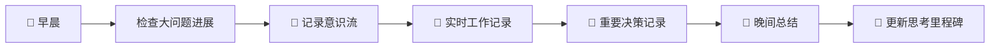

# 🌟 Irulan长期思考追踪系统 - 完整使用指南

> *"The universe is not only stranger than we imagine, it is stranger than we can imagine."*  
> —— J.B.S. Haldane

## 📖 系统概述

这是一个融合科幻想象与现实应用的智能思维管理系统，由三大科幻启发的子系统组成：

- 🧠 **长期思考追踪器** (Deep Thought) - 管理跨月/年的重大问题思考
- 🤖 **决策推理链可视化** (VIKI) - 记录完整的决策推理过程  
- 🌊 **意识流连续记录** (Neuromancer) - 捕捉连续的思维流

## 🚀 快速开始指南

### 第一次使用系统
1. **了解你的大问题**: 从 [[大问题清单]] 开始，识别需要长期思考的重要问题
2. **记录重要决策**: 使用 [[决策系统主页]] 管理重要的决策过程
3. **捕捉思维流**: 通过 [[意识流捕捉模板]] 记录日常思维片段
4. **整合到工作日志**: 将三个系统的洞察整合到日常工作记录

### 日常使用流程


---

## 🧠 Deep Thought 长期思考追踪器

### 🎯 什么时候使用
- 遇到需要几个月甚至几年才能解答的复杂问题
- 发现某个话题在意识流中反复出现
- 职业发展或人生重大选择需要系统性思考
- 技术架构或创新项目需要长期规划

### 📋 使用步骤

#### Step 1: 创建新的大问题
1. 使用 [[新大问题创建模板]] 
2. 明确问题定义和预期思考周期
3. 在 [[大问题清单]] 中注册
4. 创建专属问题文件夹

#### Step 2: 持续追踪思考过程
- **每周**: 更新思考进展，记录新洞察
- **每月**: 评估里程碑完成度，调整方向
- **每季**: 深度复盘，重新定义问题

#### Step 3: 管理相关资源
- 使用 [[灵感收集与关联模板]] 收集相关灵感
- 建立跨问题的关联关系
- 定期整理和提炼关键洞察

### 💡 使用技巧
- **不要急于求答案**: 像Deep Thought一样，耐心地让问题在时间中发酵
- **允许问题演进**: 问题定义会在思考过程中不断重新定义，这是正常的
- **建立关联网络**: 大问题之间往往有隐藏的关联，要主动寻找和建立连接
- **量化进展**: 用里程碑和完成度来量化抽象的思考过程

---

## 🤖 VIKI 决策推理链可视化

### 🎯 什么时候使用
- 面对重要且复杂的决策选择
- 需要向他人解释决策理由
- 想要提高决策质量和学习决策能力
- 需要追踪决策效果和改进决策方法

### 📋 使用步骤

#### Step 1: 定义决策问题
1. 使用 [[决策推理链模板]] 开始
2. 清晰界定决策边界和约束条件
3. 设定决策紧急程度和影响范围

#### Step 2: 系统性分析
- **信息收集**: 全面收集相关信息和数据
- **选项分析**: 识别和分析所有可能的选项
- **标准设定**: 明确评估标准和权重分配
- **推理记录**: 完整记录推理过程和逻辑

#### Step 3: 决策和追踪
- **做出决策**: 基于分析结果做出最终选择
- **实施追踪**: 监控决策实施过程和效果
- **复盘学习**: 定期回顾决策质量，改进方法论

### 💡 使用技巧
- **保持客观**: 像VIKI一样基于逻辑和数据，避免情绪化决策
- **记录偏见**: 诚实记录自己的决策偏见和盲点
- **建立标准**: 为不同类型的决策建立一致的评估标准
- **学习迭代**: 用每次决策的结果来改进决策能力

---

## 🌊 Neuromancer 意识流连续记录

### 🎯 什么时候使用
- 希望捕捉创意工作中的灵感火花
- 想要了解自己的思维模式和特征
- 需要记录深度思考的完整过程
- 寻找看似无关概念之间的隐藏联系

### 📋 使用步骤

#### Step 1: 实时捕捉
1. 使用 [[意识流捕捉模板]] 开始记录
2. 随时记录转瞬即逝的思维片段
3. 不要过度修饰，保持思维的原始性

#### Step 2: 分类和标记
- **创意灵感**: 标记新的想法和创意闪现
- **问题思考**: 记录对问题的新角度思考
- **关联发现**: 发现不同概念之间的连接
- **情感感受**: 记录情绪和直觉判断

#### Step 3: 分析和应用
- **模式识别**: 定期分析思维模式和特征
- **关联建立**: 将思维片段与大问题关联
- **洞察提炼**: 从意识流中提炼有价值的洞察

### 💡 使用技巧
- **保持真实**: 记录真实的思维状态，不要美化或修饰
- **及时记录**: 思维转瞬即逝，要及时捕捉重要的思维片段
- **寻找模式**: 定期回顾意识流，寻找重复出现的话题和模式
- **连接整合**: 将意识流的洞察整合到长期思考和决策中

---

## 🔄 三大系统协同使用

### 系统间的相互支持
```
🌊 意识流 ←→ 🧠 长期思考 ←→ 🤖 决策推理
    ↓              ↓              ↓
  创意火花        系统洞察        理性分析
    ↓              ↓              ↓
        📝 整合到工作日志系统
```

### 协同使用场景

#### 场景1: 重大项目规划
1. **意识流记录**: 捕捉对项目的各种想法和关切
2. **长期思考**: 将项目作为大问题进行系统分析
3. **决策推理**: 对关键选择点进行详细的决策分析
4. **工作日志**: 整合三个系统的洞察，制定具体行动计划

#### 场景2: 个人成长规划
1. **意识流记录**: 记录对个人发展的思考和感悟
2. **长期思考**: 设定长期成长目标作为大问题追踪
3. **决策推理**: 对学习路径和职业选择进行理性分析
4. **工作日志**: 定期总结成长进展和学习收获

#### 场景3: 创新项目孵化
1. **意识流记录**: 捕捉创新灵感和跨界关联
2. **长期思考**: 将创新方向作为长期探索的大问题
3. **决策推理**: 对技术路线和商业模式进行决策分析
4. **工作日志**: 记录创新过程的关键突破和学习

---

## 📊 系统效果评估

### 个人成长指标
- **思考深度**: 是否能够深入问题本质，避免表面化思考
- **决策质量**: 决策的成功率和学习效果是否在提升
- **创意产出**: 是否产生更多有价值的创意和洞察
- **认知连接**: 不同知识领域之间的关联能力是否增强

### 量化评估方法
```markdown
## 月度系统效果评估

### 🧠 长期思考追踪器
- 活跃大问题数量: X个
- 本月问题进展: Y%
- 重大洞察产生: Z次
- 问题重新定义: N次

### 🤖 决策推理链
- 重要决策记录: X个  
- 决策平均信心度: Y分
- 决策成功率: Z%
- 方法论改进: N次

### 🌊 意识流记录
- 日均思维片段: X个
- 创意灵感捕获: Y个
- 跨界关联发现: Z个
- 深度洞察产生: N个
```

---

## 🛠️ 系统维护和升级

### 定期维护任务

#### 每周维护
- [ ] 更新大问题进展和新洞察
- [ ] 检查决策实施效果
- [ ] 整理意识流中的重要片段
- [ ] 更新三个系统之间的关联

#### 每月维护  
- [ ] 生成月度思考总结
- [ ] 评估系统使用效果
- [ ] 优化模板和工作流程
- [ ] 备份重要思考成果

#### 每季度维护
- [ ] 深度复盘系统价值
- [ ] 调整长期思考重点
- [ ] 更新决策方法论
- [ ] 升级系统功能和结构

### 系统升级方向
- **AI集成**: 探索与ChatGPT等AI工具的深度集成
- **可视化增强**: 增加更多图表和可视化分析功能
- **自动化提升**: 减少手动操作，提高系统自动化程度
- **跨平台同步**: 实现多设备间的无缝同步和访问

---

## 🎯 最佳实践建议

### 新手使用建议
1. **从一个系统开始**: 不要同时启用三个系统，先熟悉一个
2. **保持简单**: 初期不要过度复杂化，重点是养成记录习惯
3. **定期回顾**: 系统的价值在于回顾和关联，不是单纯记录
4. **调整适配**: 根据个人习惯调整模板和工作流程

### 高级使用技巧
1. **建立元认知**: 不仅记录思考内容，还要分析思考过程
2. **跨时间关联**: 寻找不同时期思考之间的联系和演进
3. **多维度整合**: 从技术、商业、设计、人文等多维度思考问题
4. **系统性思维**: 将三个系统作为思维的延伸和增强工具

### 常见问题解决

#### Q: 系统太复杂，不知道从哪里开始？
A: 从意识流记录开始，它最简单也最容易产生立即的价值感。

#### Q: 大问题太抽象，难以量化进展？
A: 将大问题分解为具体的子问题和里程碑，用阶段性成果来衡量进展。

#### Q: 决策推理链太耗时？
A: 只对真正重要的决策使用完整流程，日常小决策可以使用简化版本。

#### Q: 三个系统之间缺乏关联？
A: 定期检查三个系统的内容，主动寻找和建立关联关系。

---

## 🌟 系统愿景

这个系统的最终目标是成为你的**智能思维伙伴**，帮助你：

- **思考得更深**: 通过长期追踪，深入复杂问题的本质
- **决策得更好**: 通过系统化分析，提高决策质量和学习效果  
- **创造得更多**: 通过意识流捕捉，发现更多创意和洞察
- **成长得更快**: 通过系统整合，加速个人能力的提升

## 📞 获得帮助

如果在使用过程中遇到问题或有改进建议：
- 在意识流中记录使用体验和困惑
- 将系统优化作为一个长期思考的大问题
- 对系统改进方案进行决策推理分析
- 在工作日志中定期反思系统价值

---

**系统指南版本**: v3.1  
**最后更新**: 2025-07-28T23:50:00+08:00  
**更新周期**: 每月28日更新  

*"The future is not some place we are going, but one we are creating. The paths are not to be found, but made. And the activity of making them changes both the maker and the destination."*  
—— John Schaar

**Irulan系统格言**: *Think like Deep Thought, decide like VIKI, dream like Neuromancer*

---

欢迎来到Irulan长期思考追踪系统！🚀