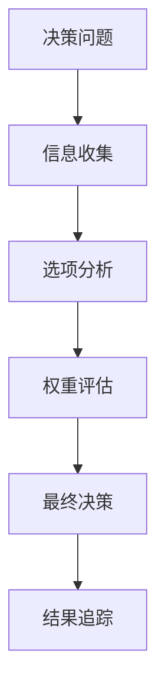

# 🤖 决策推理链：{{决策主题}}

> *"Logic is the beginning of wisdom, not the end."*  
> —— Spock (Star Trek)

**灵感来源**: 受《机械公敌》中VIKI系统启发的完整决策推理可视化

---

## 🎯 决策问题定义

### 核心决策问题
**"{{用一句话清晰描述需要做出的决策}}"**

### 决策背景
- **触发情境**: {{什么情况下需要做这个决策？}}
- **决策紧急性**: {{紧急程度评级：1-5星}}⭐⭐⭐⭐⭐
- **影响范围**: {{这个决策会影响哪些方面？}}
- **不决策的后果**: {{如果不做决策会发生什么？}}

### 决策约束条件
- **时间约束**: {{决策必须在什么时间前完成}}
- **资源约束**: {{有哪些资源限制}}
- **政策/规则约束**: {{有哪些必须遵守的规则}}
- **利益相关者约束**: {{需要考虑哪些人的利益}}

---

## 📊 信息收集与分析

### 🔍 关键信息收集
#### 必需信息清单
- [x] **{{信息类型1}}**: {{具体信息内容}}
  - 来源: {{信息来源}}
  - 可靠性: {{评估信息可靠性}}
  - 获取日期: {{YYYY-MM-DD}}

- [x] **{{信息类型2}}**: {{具体信息内容}}
  - 来源: {{信息来源}}
  - 相关性: {{与决策的相关程度}}
  - 获取日期: {{YYYY-MM-DD}}

- [ ] **{{信息类型3}}**: {{仍需获取的信息}}
  - 获取计划: {{如何获取这个信息}}
  - 重要性: {{对决策的重要程度}}

#### 信息分析矩阵
| 信息类型 | 支持选项A | 支持选项B | 支持选项C | 中性 | 备注 |
|----------|-----------|-----------|-----------|------|------|
| {{信息1}} | ✅ | ❌ | ❌ | | {{分析说明}} |
| {{信息2}} | ❌ | ✅ | ❌ | | {{分析说明}} |
| {{信息3}} | | | | ✅ | {{分析说明}} |

### 📈 数据驱动分析
**量化数据**:
- {{数据指标1}}: {{具体数值}} ({{数据来源}})
- {{数据指标2}}: {{具体数值}} ({{数据来源}})
- {{数据指标3}}: {{具体数值}} ({{数据来源}})

**数据可视化**:


---

## ⚖️ 选项分析与比较

### 🅰️ 选项A: {{选项A名称}}
**核心内容**: {{选项A的具体内容描述}}

**优势分析**:
- ✅ **{{优势1}}**: {{具体说明为什么这是优势}}
- ✅ **{{优势2}}**: {{具体说明为什么这是优势}}
- ✅ **{{优势3}}**: {{具体说明为什么这是优势}}

**劣势分析**:
- ❌ **{{劣势1}}**: {{具体说明风险或不足}}
- ❌ **{{劣势2}}**: {{具体说明风险或不足}}
- ❌ **{{劣势3}}**: {{具体说明风险或不足}}

**实施要求**:
- 所需资源: {{需要什么资源}}
- 时间周期: {{实施需要多长时间}}
- 成功概率: {{主观评估的成功概率}}%

### 🅱️ 选项B: {{选项B名称}}
**核心内容**: {{选项B的具体内容描述}}

**优势分析**:
- ✅ **{{优势1}}**: {{具体说明}}
- ✅ **{{优势2}}**: {{具体说明}}
- ✅ **{{优势3}}**: {{具体说明}}

**劣势分析**:
- ❌ **{{劣势1}}**: {{具体说明}}
- ❌ **{{劣势2}}**: {{具体说明}}

**风险评估**:
- **高风险**: {{识别的高风险因素}}
- **中风险**: {{识别的中风险因素}}
- **风险缓解**: {{如何缓解这些风险}}

### 🅲️ 选项C: {{选项C名称}}
**核心内容**: {{选项C的具体内容描述}}

**创新价值**:
- **突破点**: {{这个选项的创新突破在哪里}}
- **长期价值**: {{长期来看的价值潜力}}
- **可扩展性**: {{未来扩展的可能性}}

**不确定性分析**:
- **技术不确定性**: {{技术实现的不确定因素}}
- **市场不确定性**: {{市场接受度的不确定性}}
- **时机不确定性**: {{时机选择的不确定性}}

### 📊 选项对比矩阵
| 评估维度 | 权重 | 选项A | 选项B | 选项C | 说明 |
|----------|------|-------|-------|-------|------|
| {{维度1}} | {{权重%}} | {{得分}} | {{得分}} | {{得分}} | {{评分说明}} |
| {{维度2}} | {{权重%}} | {{得分}} | {{得分}} | {{得分}} | {{评分说明}} |
| {{维度3}} | {{权重%}} | {{得分}} | {{得分}} | {{得分}} | {{评分说明}} |
| {{维度4}} | {{权重%}} | {{得分}} | {{得分}} | {{得分}} | {{评分说明}} |
| **总分** | **100%** | **{{总分}}** | **{{总分}}** | **{{总分}}** | |

---

## 🎯 决策标准与权重

### 💎 核心决策标准
1. **{{标准1名称}}** (权重: {{百分比}}%)
   - **定义**: {{这个标准的具体含义}}
   - **评估方法**: {{如何评估这个标准}}
   - **重要性理由**: {{为什么这个标准重要}}

2. **{{标准2名称}}** (权重: {{百分比}}%)
   - **定义**: {{这个标准的具体含义}}
   - **量化指标**: {{如何量化这个标准}}
   - **阈值设定**: {{达标的阈值是什么}}

3. **{{标准3名称}}** (权重: {{百分比}}%)
   - **定义**: {{这个标准的具体含义}}
   - **评估维度**: {{从哪些维度评估}}
   - **权衡考虑**: {{与其他标准的权衡}}

### ⚖️ 权重确定过程
**权重设定方法**: {{使用什么方法确定权重，如专家评分、层次分析法等}}

**权重敏感性分析**:
- 如果{{标准1}}权重+10%，结果变化: {{分析结果变化}}
- 如果{{标准2}}权重-15%，结果变化: {{分析结果变化}}

---

## 🧠 决策推理过程

### 🔄 推理步骤
#### Step 1: 初步筛选
**筛选标准**: {{用什么标准进行初步筛选}}
**筛选结果**: {{哪些选项通过了初步筛选}}
**筛选依据**: {{筛选的具体依据和逻辑}}

#### Step 2: 深度分析
**分析重点**: {{重点分析了哪些方面}}
**关键发现**: {{分析过程中的关键发现}}
**意外洞察**: {{是否有意外的洞察产生}}

#### Step 3: 情境模拟
**最佳情境下**: {{如果一切顺利，各选项的表现}}
**最坏情境下**: {{如果遇到困难，各选项的抗风险能力}}
**最可能情境下**: {{在最可能的情况下，各选项的表现}}

#### Step 4: 直觉校验
**理性分析结果**: {{基于数据和逻辑的分析结果}}
**直觉感受**: {{凭借直觉倾向于哪个选项}}
**直觉与理性的一致性**: {{是否一致，如不一致如何解释}}

### 🤖 VIKI式逻辑推理
```
IF ({{条件1}}) AND ({{条件2}}) 
THEN {{推理结论1}}
BECAUSE {{支撑理由}}

IF NOT ({{条件3}}) OR ({{条件4}} < {{阈值}})
THEN EXCLUDE {{选项名称}}
BECAUSE {{排除理由}}

THEREFORE: {{最终逻辑结论}}
```

---

## ✅ 最终决策

### 🎯 决策结果
**选择的选项**: {{选项X}} - {{选项名称}}

**决策信心度**: {{1-10评分}}分 ⭐⭐⭐⭐⭐⭐⭐⭐⭐⭐

### 📝 决策理由
**主要理由**:
1. **{{理由1}}**: {{详细说明第一个选择理由}}
2. **{{理由2}}**: {{详细说明第二个选择理由}}  
3. **{{理由3}}**: {{详细说明第三个选择理由}}

**权衡考虑**:
- **放弃了什么**: {{选择这个选项意味着放弃了什么}}
- **承担的风险**: {{选择这个选项需要承担什么风险}}
- **风险缓解计划**: {{如何缓解这些风险}}

### 🔍 决策质量自评
- **信息充分性**: {{信息收集是否充分}} ⭐⭐⭐⭐⭐
- **分析客观性**: {{分析是否客观}} ⭐⭐⭐⭐⭐
- **选项全面性**: {{选项考虑是否全面}} ⭐⭐⭐⭐⭐
- **标准合理性**: {{决策标准是否合理}} ⭐⭐⭐⭐⭐

---

## 📈 实施计划与追踪

### 🗓️ 实施计划
**阶段1**: {{阶段名称}} ({{时间范围}})
- [ ] {{具体任务1}}
- [ ] {{具体任务2}}
- [ ] {{具体任务3}}

**阶段2**: {{阶段名称}} ({{时间范围}})
- [ ] {{具体任务1}}
- [ ] {{具体任务2}}

**阶段3**: {{阶段名称}} ({{时间范围}})
- [ ] {{具体任务1}}
- [ ] {{具体任务2}}

### 📊 成功指标
- **{{指标1}}**: {{具体指标定义}} - 目标值: {{目标值}}
- **{{指标2}}**: {{具体指标定义}} - 目标值: {{目标值}}
- **{{指标3}}**: {{具体指标定义}} - 目标值: {{目标值}}

### 🔄 追踪检查点
- **{{日期1}}**: 检查{{具体检查内容}}
- **{{日期2}}**: 评估{{具体评估内容}}
- **{{日期3}}**: 调整{{具体调整内容}}

---

## 📝 决策后学习

### 🎯 预期学习目标
通过这个决策的实施，期望学习到：
1. **{{学习目标1}}**: {{具体说明期望学习什么}}
2. **{{学习目标2}}**: {{具体说明期望验证什么}}
3. **{{学习目标3}}**: {{具体说明期望改进什么}}

### 🔍 复盘计划
**短期复盘** ({{实施后1个月}}):
- 决策执行情况评估
- 初期结果与预期对比
- 早期问题识别和应对

**中期复盘** ({{实施后3个月}}):
- 决策效果综合评估
- 意外情况和应对总结
- 决策过程改进建议

**长期复盘** ({{实施后6-12个月}}):
- 决策长期影响评估
- 决策质量全面回顾
- 决策能力提升总结

---

## 🤖 决策推理链总结

### 📊 推理链完整性检查
- [x] 问题定义清晰
- [x] 信息收集充分
- [x] 选项分析全面
- [x] 标准设定合理
- [x] 推理过程逻辑
- [x] 决策结果明确
- [x] 实施计划具体
- [x] 追踪机制建立

### 🎯 关键成功因素
1. **{{成功因素1}}**: {{为什么这个因素对成功至关重要}}
2. **{{成功因素2}}**: {{为什么这个因素对成功至关重要}}
3. **{{成功因素3}}**: {{为什么这个因素对成功至关重要}}

### 🔮 决策影响预测
**短期影响** (1-3个月):
- {{预测的短期影响1}}
- {{预测的短期影响2}}

**中期影响** (3-12个月):
- {{预测的中期影响1}}
- {{预测的中期影响2}}

**长期影响** (1年以上):
- {{预测的长期影响1}}
- {{预测的长期影响2}}

---

**决策完成时间**: {{YYYY-MM-DDTHH:MM:SS+08:00}}  
**下次追踪时间**: {{YYYY-MM-DD}}  
**决策复盘时间**: {{YYYY-MM-DD}}

*"In any moment of decision, the best thing you can do is the right thing, the next best thing is the wrong thing, and the worst thing you can do is nothing."*  
—— Theodore Roosevelt

---

**VIKI系统状态**: ✅ 决策推理链完成，进入实施追踪模式

**使用说明**:
1. 完整填写所有推理步骤，确保决策过程可追溯
2. 定期更新实施进展和结果评估
3. 诚实记录决策过程中的偏见和限制
4. 用决策结果验证和改进决策方法论